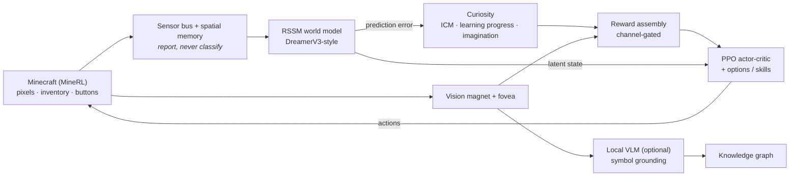

<div align="center">

# Developmental AI — SkyBot

**A curiosity-driven neurosymbolic reinforcement-learning agent that learns Minecraft from scratch.**

[](https://github.com/RyanMoore-phys/Developmental-AI/actions/workflows/ci.yml)
[](LICENSE)
[](requirements.txt)
[](https://pytorch.org)
[](#the-standing-principle)

No demonstrations, no videos, no recipe book, no reward for things a human
thinks are important. It gets pixels and buttons, and has to find out what
they do.

[Architecture](docs/ARCHITECTURE.md) ·
[Replication](docs/REPLICATION.md) ·
[Operations](docs/OPERATIONS.md) ·
[Incident record](CLAUDE.md)

</div>

> [!NOTE]
> This is an active research project, not a library. The headline objective —
> chopping a tree — **has not been learned yet**, and the README says so on
> purpose. See [the standing principle](#the-standing-principle).

## Contents

- [The standing principle](#the-standing-principle)
- [Architecture](#architecture)
- [What's inside](#whats-inside)
- [Requirements](#requirements)
- [Quickstart](#quickstart)
- [Hardware](#hardware)
- [Documentation](#documentation)
- [Repository layout](#repository-layout)
- [Contributing](#contributing)
- [Citation](#citation)
- [License](#license)

---

## The standing principle

> **Meaning and skill are earned from experience, never declared.**

This is a constraint, not a slogan. The build fails if a scripted macro appears
in the config — `tests/_no_scripted_skills_smoke.py` enforces it. If you think
you need to hand the agent a "chop tree" primitive, the answer is no, and the
test will say so.

The honest consequence: **chopping a tree has never been learned.** Across the
project's history, 399 blocks broken produced exactly 1 log; a later run reached
13,305 breaks and 35 logs, with every log-related skill still at 0/20. Most
apparent "progress" turned out to be the agent finding a way to get paid for
doing nothing — staring at the sky (96% of its drive), sitting in a villager's
trade menu (77% of its income), holding attack against an unreachable trunk.

That scoreboard is kept deliberately visible. It is the point of the project,
and it is why every reward change here is judged against block counts rather
than against the reward number — which has been wrong every single time.

---

## Architecture



Everything above is owned by one loop, `core/developmental_loop.py`. See
[`docs/ARCHITECTURE.md`](docs/ARCHITECTURE.md) for streams, subsystems and the
full reward structure.

---

## What's inside

| piece | where | role |
|---|---|---|
| DreamerV3-style RSSM world model | `world_model/rssm.py` | predicts latents; the substrate for imagination |
| PPO actor-critic | `policy/actor_critic.py` | the shared policy every skill copies from |
| Options / SMDP | `policy/options.py` | skills as temporally-extended actions |
| ICM + learning-progress curiosity | `curiosity/` | the intrinsic drive |
| Imagination curiosity | `curiosity/imagination_curiosity.py` | the drive that survives a mastered world |
| Vision magnet + fovea | `llm/vision_scaffold.py` | curiosity-ranked visual seeking |
| Local VLM (optional) | `llm/vlm_symbolizer.py` | symbol grounding from pixels |
| Knowledge graph | `knowledge_graph/` | asserted and retracted facts |
| Sensor bus | `sensors/` | transducers that report, never classify |
| Spatial memory | `spatial/` | egocentric occupancy, successor map |
| The loop that owns all of it | `core/developmental_loop.py` | reward assembly, stepping, training |

Two design rules worth knowing before reading the code:

**Senses vs meanings.** A sense is a transducer reporting a physical quantity
without naming it; a meaning classifies. Senses may feed the policy. Meanings
are evaluation-only — the agent is never handed a label it did not earn.

**Reward channels are not interchangeable.** `intrinsic` is zeroed while a GUI
is open; any penalty placed there is erased exactly when it is needed. Before
adding a reward term you must answer: which channel, is it gated, does it
survive occlusion, and what does it pay while the agent does nothing?

---

## Requirements

| | needed for | notes |
|---|---|---|
| Python 3.9+ | everything | use a venv; system Python lacks the deps |
| PyTorch | everything | CPU is enough for the test suites |
| MineRL + Java | training | built from source; see [`docs/MINERL_BUILD.md`](docs/MINERL_BUILD.md) |
| A Minecraft (Paper) server | training | see [`docs/GAME_SERVER.md`](docs/GAME_SERVER.md) |
| NVIDIA GPU, 8 GB+ | training | see [Hardware](#hardware) |
| Ollama | optional | serves the local VLM for symbol grounding |

The unit and contract test tiers need only Python and the packages in
`requirements.txt` — no GPU, no Minecraft.

---

## Quickstart

```bash
git clone https://github.com/RyanMoore-phys/Developmental-AI.git
cd Developmental-AI
python3 -m venv venv && ./venv/bin/pip install -r requirements.txt

PYTHONPATH=. ./venv/bin/python tests/run_all.py unit       # ~3s
PYTHONPATH=. ./venv/bin/python tests/run_all.py contract   # ~10s
```

Tests are standalone `__main__` scripts, not pytest. Each prints numbered
contract lines and ends with `[name] ALL PASS`.

The two tiers mean different things. A **unit** failure is a bug in a function.
A **contract** failure means a design claim stopped holding — those docstrings
name the live incident and the measured numbers, and one going red is a
finding, not a chore.

Training does not run on a laptop. See **[`docs/REPLICATION.md`](docs/REPLICATION.md)**.

---

## Hardware

The reference deployment is deliberately modest, and every number below was
measured rather than estimated:

| | reference | note |
|---|---|---|
| GPU | 8 GB VRAM | tight. The world model peaks near 6.7 GB in fp32 |
| RAM | 16 GB | forced `batch_size` 16 → 8 and made a local 3B VLM unaffordable |
| Disk | 256 GB | all brain state lives here, unbacked |
| CPU | 6 cores | the Minecraft clients compete with torch |

**Throughput is the binding constraint**, not capability: ~0.6 environment
steps/second against a ~10/s ceiling, which makes the configured 4M-step budget
roughly 77 days. Spend better hardware on throughput first.

---

## Documentation

| read this | for |
|---|---|
| [`docs/ARCHITECTURE.md`](docs/ARCHITECTURE.md) | how the organism is wired — streams, subsystems, reward structure |
| [`docs/REPLICATION.md`](docs/REPLICATION.md) | standing it up from bare machines |
| [`docs/OPERATIONS.md`](docs/OPERATIONS.md) | running it, reading status, crashes, backups |
| [`docs/MONITORING.md`](docs/MONITORING.md) | the two metric stacks and how to extend them |
| [`docs/GAME_SERVER.md`](docs/GAME_SERVER.md) | the Minecraft server side — version bridge, RCON, tailnet ACL |
| [`docs/MINERL_BUILD.md`](docs/MINERL_BUILD.md) | why the MineRL build is the way it is; read when provisioning fails |
| [`docs/TESTING_PLAN.md`](docs/TESTING_PLAN.md) | how any of it gets proven |
| [`docs/PERSPECTIVE_LEARNING.md`](docs/PERSPECTIVE_LEARNING.md) | learning 3D structure from 2D motion |
| [`docs/PLURALITY_ROADMAP.md`](docs/PLURALITY_ROADMAP.md) | richer observation structure, phases 1–7 |
| [`docs/GENERAL_INFRASTRUCTURE.md`](docs/GENERAL_INFRASTRUCTURE.md) | domain-independent redesign |
| [`CLAUDE.md`](CLAUDE.md) | **the incident record** — recurring bug classes, each paid for by a failed run |

If you read only one supporting document, make it `CLAUDE.md`. It is written
for coding agents working on this repo, but it is the most useful thing here
for a human too: every rule in it exists because something broke.

---

## Repository layout

```
developmental_ai/     the agent
  core/               the loop that owns everything
  world_model/        RSSM, replay buffer
  policy/             actor-critic, options
  curiosity/          ICM, learning progress, imagination
  sensors/  spatial/  slots/   perception and memory
  environments/       Minecraft adapter (the only engine-specific file)
  infra/              gates, ledger, empowerment, advisor
configs/              minecraft_skybot.yaml is the one that matters
tests/                standalone contract + unit suites
scripts/              provisioning, deploy, launch, exporters
docker/               CI runner and monitoring stacks
docs/                 everything above
```

---

## Contributing

CI runs on GitHub-hosted runners for every push and pull request. Deployment
workflows run on a self-hosted runner and are gated to the upstream repository
— a fork's pull request cannot reach it.

If you change a reward term, say in the PR what it pays while the agent does
nothing. That question has caught more bugs here than any other.

---

## Citation

If this work is useful in your research, please cite the repository:

```bibtex
@software{moore_developmental_ai,
  author = {Moore, Ryan},
  title  = {Developmental AI — SkyBot: a curiosity-driven agent that learns Minecraft from scratch},
  year   = {2026},
  url    = {https://github.com/RyanMoore-phys/Developmental-AI}
}
```

---

## License

MIT — see [`LICENSE`](LICENSE).

The MineRL dependency and the Minecraft client it builds carry their own terms;
this licence covers the code in this repository only.
