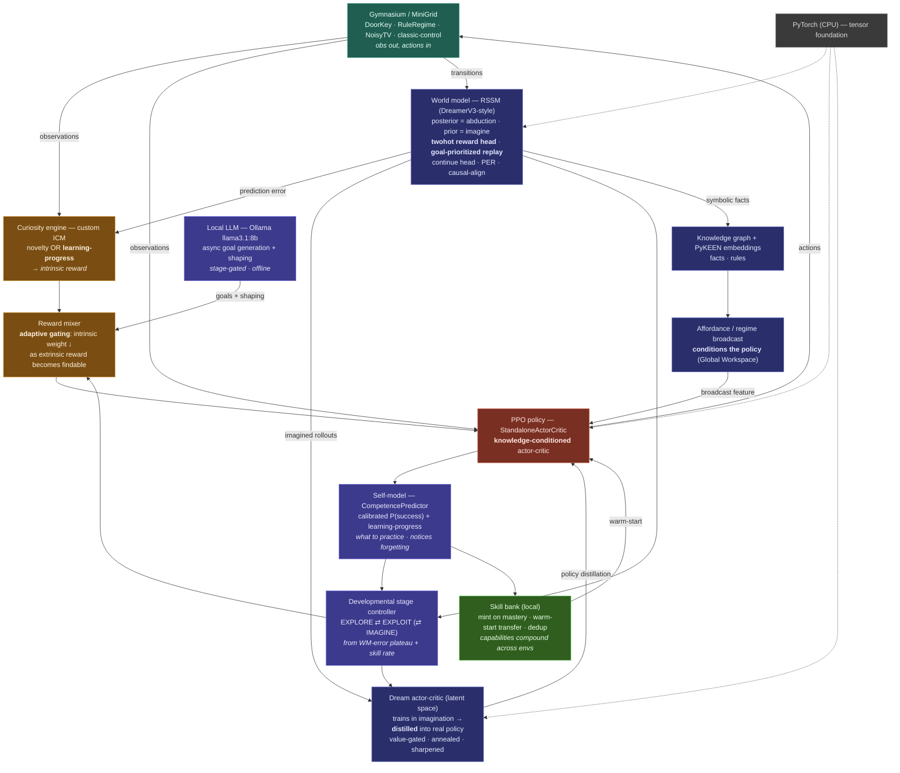
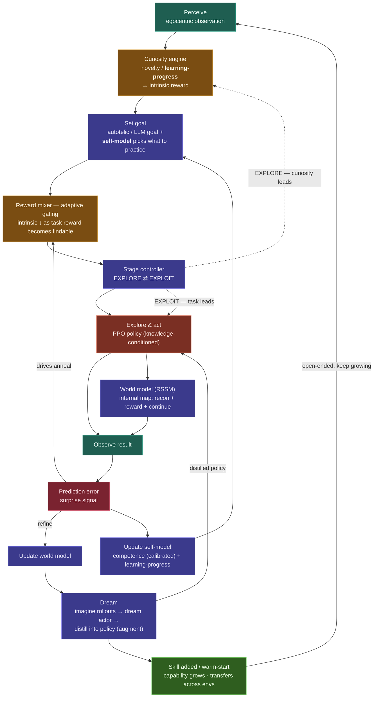

# Developmental AI — current flow maps (the real organism)

These redraw the two original concept diagrams against **how the system actually
works today**, after the rung ladder + integration capstone. Key differences from
the original aspirational stack:

- The "Stable-Baselines3 policy" is a **custom `StandaloneActorCritic` (PPO)**, with
  a **knowledge-conditioned actor** (symbolic feature-conditioning, Path A).
- "DreamerV3" is a **custom RSSM world model** — now with a **twohot reward head**,
  **goal-prioritized replay**, and an optional **causal action-alignment** fix.
- "Curiosity Baselines + ICM" is a **custom ICM**, with a **learning-progress** mode
  (rewards error *reduction*, ignores the noisy-TV trap).
- The **skill bank is local** (not HF Hub); the **KG uses PyKEEN embeddings** (no Neo4j),
  and the **GNN→graph path is largely decorative** — the load-bearing symbolic signal
  is the **affordance/regime broadcast** that conditions the policy.
- New organs the original didn't have: **reward mixer with adaptive gating**,
  **developmental stage controller**, **dream actor + distillation (augment)**, and a
  **self-model (competence predictor)**.

Legend (node colour = role): 🟩 perception · 🟧 curiosity/drive · 🟦 goals & world model ·
🟫 action · 🟥 error/learning signal · 🟩(dark) skills/memory.

---

## 1) Architecture — what the organism is made of

---

## 2) The developmental learning loop — how it runs

---

## 3) Honesty overlay — which paths are *proven* load-bearing

The map above is the **full intended organism**. What the falsifiable rung tests
actually established about each path:

| Path | Status | Evidence |
|---|---|---|
| Curiosity (learning-progress) — reward-free exploration | ✅ **essential** | Rung 3: LP ≫ novelty on noisy-TV (4/4 seeds) |
| Symbolic **broadcast** conditioning the policy | ✅ **load-bearing under hidden structure** | Rung 6: content lesion craters behaviour (4/4, decisive) |
| Self-model causally driving behaviour | ✅ **calibrated + load-bearing** | Rung 5: intact ≫ scramble (3/3); ECE ~0.03 |
| Adaptive gating (curiosity anneal) | ✅ **net-positive safeguard** | turns the Rung-1 intrinsic-tax into "never worse than vanilla" |
| Skill bank / cumulative transfer | 🟡 **works, modest** | mints + warm-starts; transfer strong but hard to beat plain policy-carry |
| Curiosity + symbolic on *findable-reward* tasks | 🟡 **mild tax** | Rung 1: plain PPO wins where reward is easy to find |
| Dreaming (imagination→policy) | 🟡 **safe, not load-bearing** | Rung 4: harm fixed; neutral — **bottlenecked by WM action-causality** |
| Counterfactual reasoning (abduction→intervene→predict) | 🟡 **machinery works, WM-limited** | Rung 8: posterior ≫ prior (abduction helps) but not decisive |
| Raw KG → GNN graph-vector path | ⬜ **decorative** | Rung 6: the load-bearing signal is the broadcast, not the GNN pool |

**The through-line:** every component earns its keep *where the task demands it* —
curiosity reward-free, the broadcast under hidden structure, the self-model for
metacognition — and is a mild tax where plain RL suffices. The recurring limiter for
the *model-based* organs (dreaming, counterfactuals) is the **world model's weak
action-conditioning**: it predicts observation dynamics well but only faintly
distinguishes *which action* causes *which outcome*.

**Integration capstone (whole-organism):** the full stack — including the local LLM —
runs end-to-end across a sequence of novel envs without falling over, and its control
signals behave (curiosity anneals, stage controller hands off, skills mint). It also
surfaced a real *compose-time* bug invisible to every isolated rung test
(dream-augment was silently incompatible with symbolic-on — since fixed). So: it
**coheres and develops autonomously**, but "smoothly" required fixing composition
failures that only appear when everything is on at once.
